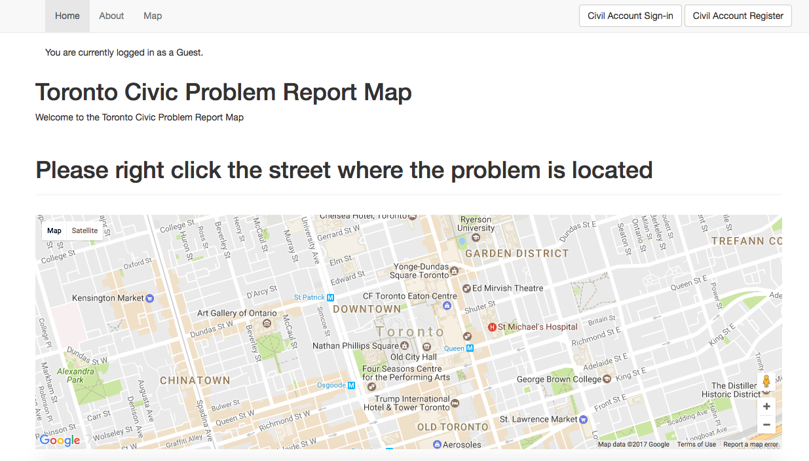
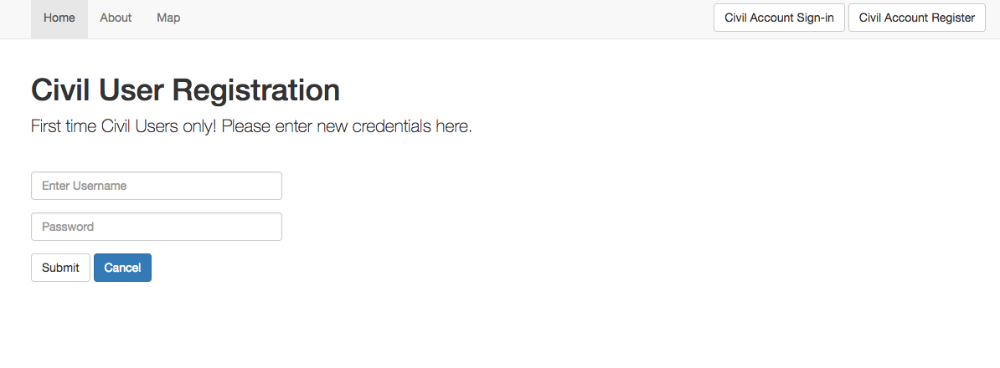

# Civil Report Map

This webapp has been designed for ordinary citizens and civil servants to report problems in the local Toronto community. 

It contains a page for reporting problems, a page for updating a problem's status by civil servants, and a database that keeps track of all the reported problems. Secure access is provided to civil servants, while the map is open for anyone to use. A user would select a problem-type from the dropdown menu on the map. This would open up a report submission where they can provide comments, and subscribe to updates on the report with an email address. 

To prevent any duplicate entries, only one type of problem is allowed within a certain radius, to be determined by the civil servant users. They also have access to problem details, updating problem status, and verifying the problem. Once a report has been submitted, it is up to the civil servants to send someone to verify the problem and update the problem status. Each time a problem status update is made, emails are sent out to subscribed users. Once a problem has been verified as false or is verified and fixed, it is removed from the database.

## How to run this app locally
* fork this repo, and download it or git clone your fork
* install npm & node
* install MongoDB directly or you can use `npm install mongodb` or `homebrew` to do the same
* node dependencies (you can simply run `npm install` if you've downloaded the `package.json` file):
    - `body-parser`
    - `connect-flash`
    - `cookie-parser`
    - `debug`
    - `express`
    - `express-session`
    - `mongoose`
    - `monk`
    - `morgan`
    - `passport`
    - `passport-local`
    - `passport-local-mongoose`
    - `pug`
    - `serve-favicon`
* running the app:
    - `cd` into the `civil-report` directory
    - `npm start`
    - if you run into problems with that: `cd` into `civil-report/bin/` and run `node www` 
    - open up your browser to `localhost:3000`